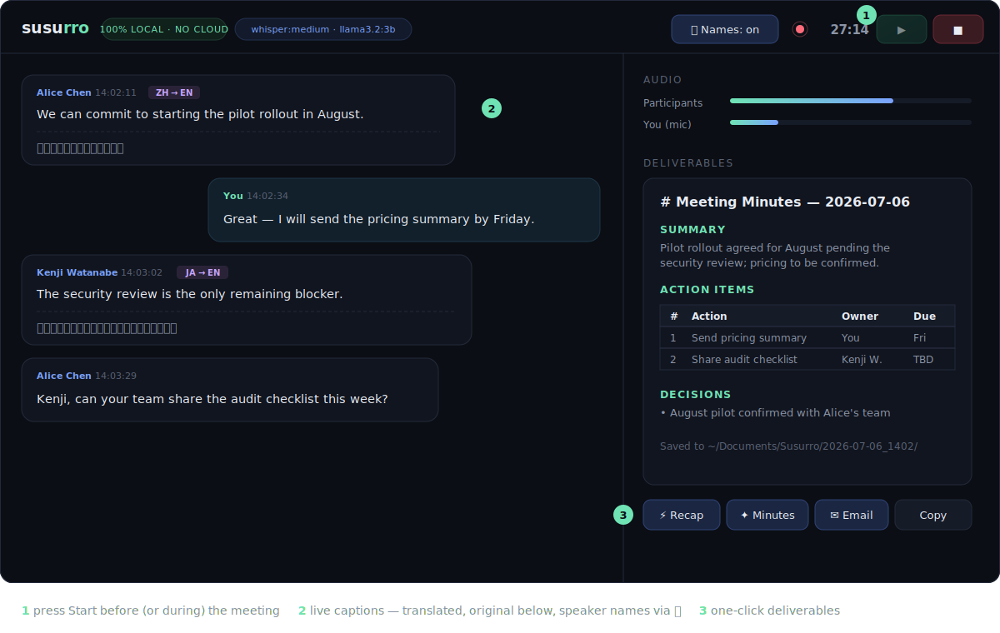

# Susurro

*Susurro — Spanish for "whisper".*

A fully-local meeting copilot for macOS. It listens to **system audio** (whatever
Teams / Zoom / Meet / a browser tab is playing) plus your **microphone**, shows
**live captions translated to English** from any language — including speakers
who **mix languages mid-sentence** — and generates **meeting minutes, quick
recaps, and follow-up email drafts** with a local LLM.

**No cloud. No bots joining your call. No audio files on disk. Nothing leaves your Mac.**



## How it works


## Requirements

- macOS **14.4+** (Apple Silicon or Intel) — uses Core Audio process taps
- Xcode Command Line Tools (`xcode-select --install`)
- [Homebrew](https://brew.sh) and Python **3.10+**
- ~4 GB disk for the local models (Whisper `medium` + `llama3.2:3b`)

## Quick start

```bash
git clone <this-repo> && cd <this-repo>
./setup.sh        # one-time: compiles the audio tap, installs deps, downloads models
./run.sh          # prints a private dashboard URL like http://127.0.0.1:8710/?t=<token>
```

1. Open the URL, press **▶ Start** before (or during) your meeting.
2. Captions stream in two lanes — *Participants* (system audio, auto-translated,
   original text underneath) and *You* (mic). Language is detected per utterance,
   and code-switching within an utterance is handled.
3. Three one-click deliverables, all generated on-device:
   **⚡ Recap** (mid-meeting "where are we"), **✦ Minutes** (summary, decisions,
   action-item table with owners), **✉ Email** (ready-to-send follow-up draft).
   **Copy** puts the Markdown on your clipboard.
4. Everything is also saved to `~/Documents/Susurro/<date_time>/`
   (`transcript.md`, `minutes.md`, `summary.md`, `email.md`).

First launch triggers two one-time macOS privacy prompts for your terminal:
**System Audio Recording** and **Microphone**. If you miss one, re-enable under
*System Settings → Privacy & Security*.

## Security model

- Web server binds `127.0.0.1` only — unreachable from your network.
- Every request requires a random per-launch token (in the printed URL, then a
  `HttpOnly`/`SameSite=Strict` cookie). Other local processes can't snoop the UI.
- Raw audio lives only in memory; it is never written to disk.
- Whisper and the minutes LLM (Ollama) run entirely on-device. The only network
  activity ever is the **one-time model download** during `setup.sh`.
- Saved transcripts/minutes go to `~/Documents/Susurro` (mode `0700`).

> ⚖️ Recording/transcribing calls may require participant consent depending on
> your jurisdiction and company policy — that decision is yours.

## Tuning (`config.json`)

| Key | Default | Notes |
|-----|---------|-------|
| `whisper_model` | `medium` | `small` = faster/lighter; `large-v3` = best accuracy, more latency |
| `whisper_backend` | `auto` | `auto` = Metal GPU (MLX) on Apple Silicon, CPU elsewhere; force with `mlx`/`ct2` |
| `llm_num_ctx` | `8192` | LLM context window; longer meetings are automatically condensed to fit |
| `language` | `""` (auto) | pin the source language (e.g. `"ja"`, `"zh"`, `"ko"`, `"hi"`) if auto-detect misfires |
| `show_original` | `true`  | also show untranslated text under each caption |
| `ollama_model`  | `llama3.2:3b` | default LLM for deliverables; the dashboard's **LLM dropdown** offers every pulled model per-generation — `ollama pull qwen2.5:7b` for richer minutes |
| `vocabulary` | `""` | jargon/product names to bias transcription, e.g. `"Kubernetes, Terraform, POC"` |
| `meeting_context` | `""` | one sentence about you/your meetings to shape minutes & emails, e.g. `"You are a sales engineer meeting customers."` |
| `mic_aec` | `true` | echo-cancelled mic (Apple voice processing): on open speakers, meeting audio is subtracted from your mic lane. Set `false` for the raw mic |
| `speaker_ocr` | `false` | start with speaker names on (same as the 👤 toggle in the dashboard) |
| `segment_silence_seconds` | `0.8` | pause length that ends an utterance |

After changing `whisper_model` or `ollama_model`, run `./setup.sh` once to fetch it.

### Asian & other non-Latin languages

All Whisper languages work out of the box — Chinese, Cantonese, Japanese,
Korean, Thai, Vietnamese, Hindi, Tamil, Indonesian, Tagalog, and ~90 more.
Original-language captions render with the correct script, glyph variants,
and line-breaking. Two tips for best results:

- The default `medium` model handles Asian languages well; `large-v3` is
  noticeably better still if you can take the extra latency. Avoid `small`
  for CJK/Thai/Vietnamese-heavy meetings — its accuracy drops sharply.
- Auto-detection can confuse related languages on short utterances
  (e.g. Mandarin/Cantonese/Japanese, Malay/Indonesian). For a
  single-language meeting, pin it with e.g. `"language": "ja"` — this also
  skips detection, reducing latency. Leave it `""` for mixed-language calls.

### Speaker names (experimental)

The **👤 Names** toggle labels participant captions with real names — no bot
in the call: it reads the active-speaker name that Zoom/Teams already draw on
screen, using ScreenCaptureKit + Apple's on-device Vision OCR (~1 frame/s,
OCR'd in memory, never stored). Minutes then get real action-item owners
("Alice to send pricing by Friday" instead of "Participant").

- Off by default; first use prompts for the **Screen Recording** permission.
- Best-effort by design: works best in **speaker view** on Zoom / Teams
  desktop; in gallery view it abstains rather than guess. Overlapping voices
  follow whoever the meeting app highlights. Expect occasional mislabels.
- Teams: keep the meeting in its own pop-out window (the Teams default) —
  the main Chat/Activity window is deliberately ignored.
- Meet/browser meetings aren't recognized yet (desktop Zoom/Teams only).

## Platform support

macOS only, by design: the app-agnostic capture relies on Core Audio process
taps, which have no direct Windows/Linux equivalent. Everything except
`capture/systemaudio.swift` is portable Python — a Windows port would swap in a
WASAPI-loopback capture backend and keep the rest unchanged. PRs welcome.

## License & third-party

- This project: [MIT](LICENSE).
- Python dependencies (FastAPI, uvicorn, faster-whisper, sounddevice, NumPy,
  requests) are MIT/BSD/Apache-2.0 licensed.
- Models are **downloaded by you at setup time, not distributed with this repo**:
  Whisper weights are MIT; the default minutes model (`llama3.2:3b`) is covered
  by the [Llama 3.2 Community License](https://github.com/meta-llama/llama-models/blob/main/models/llama3_2/LICENSE)
  — swap `ollama_model` for e.g. `qwen2.5:7b` (Apache-2.0) if that matters to you.

## Notes & limits

- Works with **any** meeting app — nothing is injected into the call; the tap is
  read-only on the Mac's output mix.
- Headphones optional: the mic is captured through Apple's voice-processing
  engine (echo cancellation), so on open speakers your lane hears you, not the
  meeting playback. If the helper can't start, Susurro falls back to the raw mic
  — then headphones are recommended.
- If you switch audio output devices mid-meeting (e.g. AirPods connect), press
  Stop/Start to re-attach the tap to the new device.
- Translation quality: Whisper translates *to English only* (that's the use case).
- On Apple Silicon, Whisper runs on the **Metal GPU via MLX** — `medium` (the
  default) keeps up with live speech comfortably, and `large-v3` is viable
  when accuracy matters more than latency. Intel Macs fall back to CPU
  (CTranslate2); prefer `small` there if captions lag. (`beam_size` applies
  to the CPU backend only.)
- Meeting minutes handle any meeting length: transcripts too long for the
  LLM's context window are condensed chunk-by-chunk first, so the start of a
  long meeting is never silently dropped.
